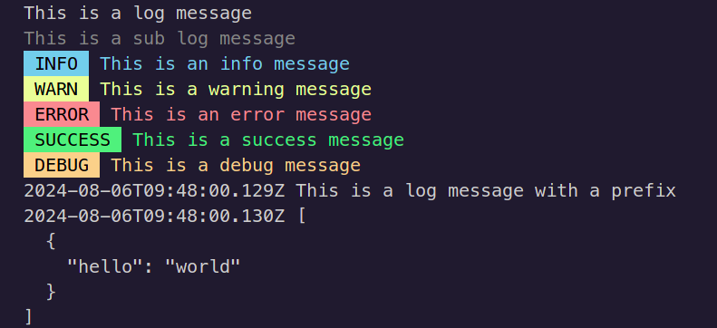

# Logger 📝

Logger is an intuitive and robust tool tailored for logging messages across all your applications, whether it's a complex web application or a simple script. Ensure every important event is captured with Logger!



## Features 🌟

- **Simple Integration:** Effortlessly embed Logger into your projects.
- **Versatile:** Suitable for both development and production environments.
- **Asynchronous Support:** Built to handle modern asynchronous JavaScript workflows.

## Installation 🔧

Install Logger with a simple command:

```bash
npm install @rharkor/logger
```

## Usage 🛠️

### Logger

To start using Logger in your project, simply import and utilize the logging functions as shown:

```typescript
import { logger } from "@rharkor/logger"

logger.log("This is a log message") // For general logs
logger.subLog("This is a sub log message") // For sub logs
logger.info("This is an info message") // For informational messages
logger.warn("This is a warning message") // For warnings
logger.error("This is an error message") // For errors
logger.success("This is a success message") // For success messages
logger.debug("This is a debug message") // For debugging messages
```

#### Debugging logs

Logger supports debugging logs, which are disabled by default. To enable debugging logs, set the `LOGGER_ENV` environment variable to `development` and it will automatically enable debugging logs. If the environment variable is not set, Logger will default to `production` and debugging logs will be disabled.

### Task

Logger also supports task logging, which is useful for tracking the progress of a task. Here's how you can use it:

```typescript
import { task } from "@rharkor/logger"

const testTask = async () => {
  const task1 = await task.startTask({
    name: "Task 1",
  })
  await new Promise((resolve) => setTimeout(resolve, 500))
  for (let i = 0; i < 50; i++) {
    task1.print("This is a task message " + i)
    await new Promise((resolve) => setTimeout(resolve, 50))
  }
  task1.stop("Task 1 is done")
}

testTask()
```

## Common Issues and Troubleshooting 🔍

Encountering the warning `Logger is not initialized yet. Please call and await logger.init()`? This means you're attempting to log a message before Logger is ready. Initialization typically completes in under a second.

**Remember: Logger initializes automatically upon import.**

### Resolution Steps

To fix initialization issues, make sure to await the `init()` method before logging:

```typescript
import { logger } from "@rharkor/logger"

async function main() {
  await logger.init()
  logger.info("This is an info message")
}

main()
```

### Explanation

To accommodate CommonJS compatibility, we asynchronously load dependencies like `chalk`. This setup requires that Logger isn't instantly ready upon import.

## License 📄

This project is distributed under the MIT License. For more details, see the [LICENSE](LICENSE) file in the repository.

This enhanced README not only clarifies usage but also incorporates emojis to make it more engaging and reader-friendly.
